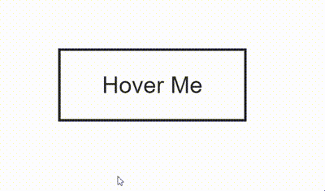
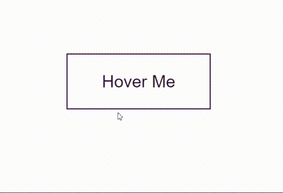
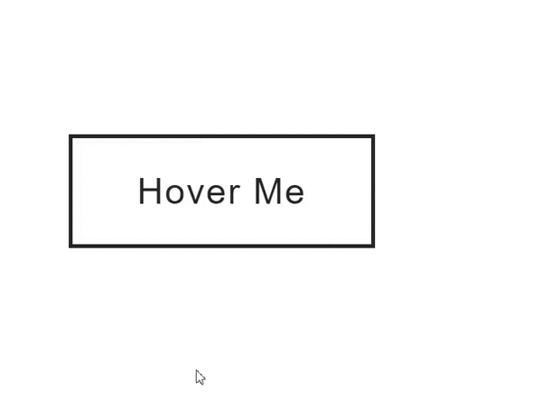
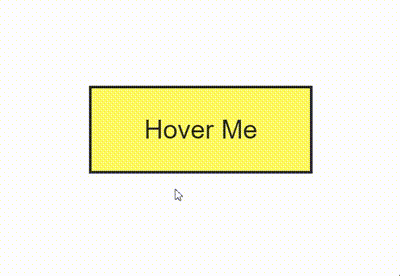
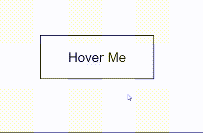
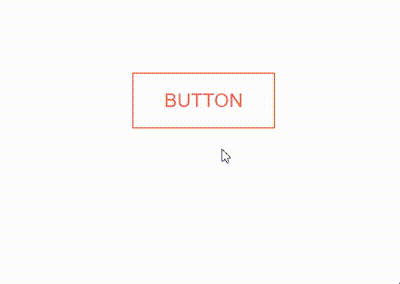
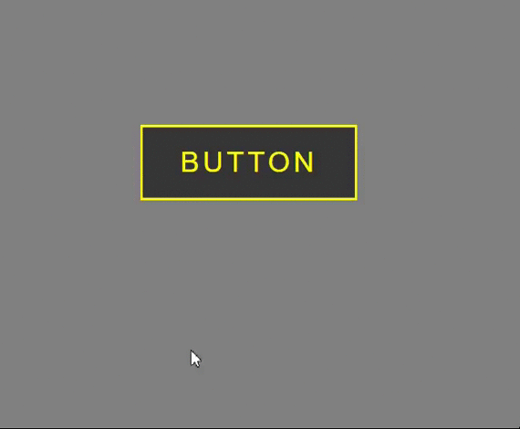

# HOVER1-

Do you want some super classy hover effects? then this repo is for you. I know it shows only html files, but internal css have been embedded in html itself.
you just have to copy the code, and it will save your 15-30min that you have generally spent on finding ideas and writing code.
 
<h3>Type1</h3>
 

<h3>Type2</h3>
 

<h3>Type3</h3>
 

<h3>Type4</h3>
 

<h3>Type5</h3>
 

<h3>Type6</h3>
 

<h3>Type7</h3>
 

<h3>Type8</h3>
 

<h3>Type9</h3>
 

<h3>Type10</h3>
 

<h3>Type11</h3>
 

<h3>Type12</h3>
 

